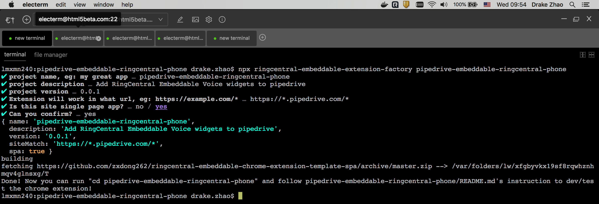

# ringcentral-embeddable-extension-factory
Cli tool to create a RingCentral Embeddable Voice chrome extension start kit for sites.



## features
- Build src with webpack 4/babel etc
- eslint check before push
- Fully extendable/custmizable
- Simplify basic click-to-call feature with config

## use
1. init
```bash
# make sure you have npm@5.2+ installed
npx ringcentral-embeddable-extension-factory my-app
# or install it first
# npm i -g ringcentral-embeddable-extension-factory && reef my-app
# then carefully answer all questions, then the my-app folder will be create
cd my-app
npm i
npm start
```
2. Go to Chrome extensions page.
3. Open developer mode
4. Load `my-app/dist` as unpacked package.
5. Goto your site to see

## dev
- Edit `src/*`, after the auto build complete, go to Chrome extensions page, click refresh button in your extension card, then refresh your site to see the change.
- [Add click to call button](docs/add-click-to-dial-button.md)
- [Add hover to show click-to-call-button](docs/add-hover-to-show-click-to-call-button.md)
- [Add contacts related feature](docs/add-contacts-features.md)
- [Add call log sync](docs/add-call-log-sync.md)
- Use custom icons:
  * Just replace `my-app/dist/icons/*.png` with your icon pngs, must be same size.
- Enable pre-push eslint check:
  * Uncomment `// cp(prePushPathFrom, prePushPath)` in `bin/post-install.js` and run `npm i`, then if there is eslint error in `src/*`, push will be stopped.
- Build with your own ClinetID and AppServer:
  * Run `cp config.sample.js config.js`
  * Create an app from https://developer.ringcentral.com/, make sure you choose a browser based app, and set all permissions, and add `https://ringcentral.github.io/ringcentral-embeddable/redirect.html` to your redirect URI list, Edit `config.js`,

  * Fill your RingCentral app's clientID and appServer in `config.js`

## License
MIT


